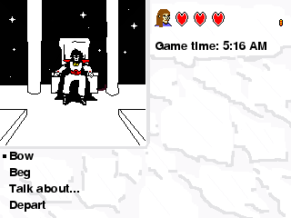

# What is "dirt"?
A first-person, turn-based adventure game written in Pygame.

## Running
If you just want to play the game (without developing it), I recommend installing it with `pip` in one of the following ways.

To install it straight from Github (requires Git):

    pip install git+https://github.com/unternehmen/dirt

To install it from a downloaded copy:

    cd dirt-**version**
    pip install .

After it is installed, you can run it with this command:

    dirt

## Developing
If you want to develop the game, you should install it in a different
way.  Clone the repository with Git, i.e.:

    git clone https://github.com/unternehmen/dirt

Then, navigate to the directory and install dirt as "editable":

    cd dirt
    pip install -e .

Once it is installed, you can work on the source code as much as you
want, and the installed copy will stay updated.  To run the program,
just run the command:

    dirt

## Screenshots

## License
Copyright (C) 2017 Chris Murphy and Charlie Murphy

This program is free software: you can redistribute it and/or modify
it under the terms of the GNU General Public License as published by
the Free Software Foundation, either version 3 of the License, or
(at your option) any later version.

This program is distributed in the hope that it will be useful,
but WITHOUT ANY WARRANTY; without even the implied warranty of
MERCHANTABILITY or FITNESS FOR A PARTICULAR PURPOSE.  See the
GNU General Public License for more details.

You should have received a copy of the GNU General Public License
along with this program.  If not, see <http://www.gnu.org/licenses/>.

